# LLM Firewall

**A fail-closed Rust guardrail for OpenAI-compatible LLM traffic.**

`llm-firewall` sits in front of chat completion APIs and inspects requests and responses before they touch your model provider. It is built for security teams that need a small binary, predictable behavior, JSON audit logs, and a deployment path that does not require client rewrites.

<p align="center">
  
</p>

## Why It Exists

LLM gateways are now production infrastructure. They handle user prompts, tool calls, secrets, source code, regulated data, and model responses that may be rendered directly into applications. This firewall gives that traffic a security boundary:

- Block or redact prompt injection signatures before upstream.
- Redact or block DLP matches in prompts and responses.
- Enforce mandatory system prompts.
- Restrict tool/function calls to an allow-list.
- Enforce token budgets and request rate limits.
- Strip client bearer tokens and inject the real upstream key.
- Validate `/v1/chat/completions` shape before proxying.
- Emit sanitized audit logs and Prometheus-style metrics.

## Two Deployment Patterns

### 1. Passthrough Proxy

Use this when you already call OpenAI, Azure OpenAI, vLLM, Ollama-compatible gateways, or another OpenAI-compatible endpoint directly.

```text
client -> llm-firewall:8080 -> upstream OpenAI-compatible API
```

The client changes only its `base_url`. The firewall strips the client `Authorization` header, runs the detector pipeline, injects the configured upstream key, and forwards clean traffic.

### 2. LiteLLM Edge

Use this when LiteLLM is your provider router. Bind LiteLLM to loopback or a private network, then expose only `llm-firewall`.

```text
client -> llm-firewall:8080 -> LiteLLM:4000 -> model providers
```

This keeps LiteLLM focused on routing, budgets, and provider translation while the firewall owns validation, DLP, prompt-injection checks, response sanitization, and audit policy.

## Quick Start

For local testing:

```bash
cargo run -- --config config.example.yaml
```

Send a known-clean request:

```bash
curl -sS http://127.0.0.1:8080/v1/chat/completions \
  -H "content-type: application/json" \
  -H "authorization: Bearer client-key" \
  --data @tests/fixtures/allowed_chat.json
```

For production, start from [llm-firewall.yaml](llm-firewall.yaml). It fails closed by default when the upstream API key is missing:

```yaml
upstream:
  url: "http://127.0.0.1:4000"
  api_key_env: "OPENAI_API_KEY"
  require_api_key: true
server:
  bind: "0.0.0.0:8080"
  allowed_paths:
    - "/v1/chat/completions"
  strict_chat_validation: true
```

Validate before launch:

```bash
cargo run -- --config llm-firewall.yaml --validate-config
```

## Detector Pipeline

Request path:

1. Strict chat request validation.
2. Rate limiter.
3. Token budget.
4. Prompt-injection signatures.
5. DLP rules.
6. System prompt enforcement.
7. Tool allow-list validation.
8. Upstream auth replacement.

Response path:

1. Accumulate response up to `server.max_response_buffer`.
2. DLP response scan.
3. Response tool-call validation.
4. Output sanitizer.
5. Sanitized audit log and client response.

Every proxied response includes:

```text
cache-control: no-store
x-content-type-options: nosniff
x-llm-firewall: protected
x-correlation-id: <request id>
```

## Configuration

Environment overrides:

```bash
LLMFW_BIND=0.0.0.0:8080
LLMFW_UPSTREAM_URL=http://127.0.0.1:4000
LLMFW_UPSTREAM_API_KEY_ENV=OPENAI_API_KEY
LLMFW_LOG_LEVEL=info
```

Key files:

- [config.example.yaml](config.example.yaml): local demo config.
- [llm-firewall.yaml](llm-firewall.yaml): stricter default runtime config.
- [llm-firewall.service](llm-firewall.service): systemd unit with `/etc/llm-fw/llm-firewall.env`.
- [Dockerfile](Dockerfile): container build example.

## Live Readiness

Read [docs/live-readiness.md](docs/live-readiness.md) before exposing this service.

Current production posture:

- Only configured `server.allowed_paths` are proxied upstream by default.
- Missing required upstream key returns HTTP 500 and does not call upstream.
- Invalid chat method, content type, body, model, or messages fail before upstream.
- Detector blocks short-circuit before upstream.
- Audit previews are redacted independently from DLP mutations.
- Blocked request/response audit previews are suppressed rather than sampled.
- Oversized responses fail closed instead of streaming unchecked content.

Known limits:

- Streaming uses accumulate-then-forward inspection. This prioritizes security over token-by-token latency.
- Rate limits and token budgets are in-memory per process.
- Native TLS termination and distributed audit sinks are not implemented yet.

## Verification

```bash
cargo fmt --check
cargo test --locked
cargo clippy --locked --all-targets --all-features -- -D warnings
```

Current coverage includes unit tests for detectors and binary-level integration tests for forwarding, auth replacement, validation rejection, fail-closed upstream key handling, prompt-injection blocking, DLP redaction, and output sanitization.

## Project Map

```text
src/
  config.rs              YAML config and env overrides
  proxy/handler.rs       HTTP ingress, validation, pipeline orchestration
  proxy/upstream.rs      upstream client and auth replacement
  pipeline/              detector chain and request/response contexts
  detectors/             injection, DLP, sanitizer, tools, budget, rate limit
  utils/audit.rs         sanitized JSON audit records
  utils/metrics.rs       Prometheus-style counters
tests/
  integration_test.rs    binary-level HTTP tests with mock upstream
```

## Docs

- [MVP behavior matrix](docs/mvp-behavior.md)
- [Live readiness checklist](docs/live-readiness.md)
- [Original buildout prompt](docs/deepseek_text_20260617_36ea67.txt)
